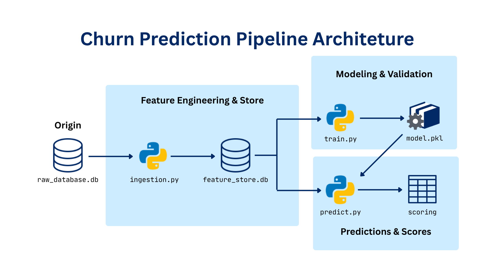

# Pipeline End-to-End para Previsão de Churn

<p align="center">

<p/>

## Contexto de Negócio

Para criadores de conteúdo e canais de streaming (Twitch, YouTube), o engajamento da comunidade é o principal motor de crescimento e monetização. Nessas plataformas, a retenção de espectadores é incentivada através de economias virtuais, onde os usuários acumulam pontos interagindo nas lives (enviando mensagens no chat, mantendo tempo de presença e streaks) para resgatar recompensas. No entanto, entender o momento exato em que um espectador engajado perde o interesse e deixa de acompanhar o canal (Churn) é um desafio crítico para a sustentabilidade e estratégia de conteúdo desses criadores.

## Objetivo

Construir a fundação de dados necessária para identificar usuários em risco de **churn**, estruturando e padronizando todo o seu histórico transacional para que algoritmos de Machine Learning possam prever essa evasão com precisão.

## Dados e Crédito

Os dados utilizados provem da interação de espectadores em plataformas de streaming (Twitch, YouTube). Nesse ecossistema, usuários ganham pontos por engajamento durante as _lives_ (mensagens no chat, tempo de presença, _streaks_) e os resgatam por recompensas. A partir desse histórico, o projeto busca identificar clientes com risco de **churn**

Contexto de negócio e dataset originais vêm do curso **"Data Science & Pontos"**, de Téo Calvo ([Téo Me Why](https://youtube.com/@teomewhy)), sob licença **[CC BY-NC-SA 4.0](https://creativecommons.org/licenses/by-nc-sa/4.0/)**. A implementação deste repositório, pipeline, convenções de nomenclatura, configuração em YAML, documentação das feature stores é autoral, construída a partir do aprendizado no curso, não reproduzindo o material original diretamente.

## Estrutura de pastas

```
twitch-churn-predictor/
├── pyproject.toml
├── uv.lock
├── .python-version
├── README.md
├── assets/
├── data/
│   ├── raw_database.db           # banco de dados de origem
│   └── feature_store.db          # banco de destino (feature stores + predições)
├── model/
│   └── baseline.pkl              # exemplo de modelo treinado + features + métricas
├── docs/
│   └── database.md               # dicionário de dados do banco de origem
└── src/
    ├── run_scoring.sh            # roda ingestão + predição em sequência
    ├── feature_store/
    │   ├── ingest.py
    │   ├── config.yaml
    │   ├── queries/               # *.sql - query de cada feature store
    │   └── docs/                  # *.md — dicionário de dados de cada feature store
    ├── train/
    │   ├── train_churn_model.py
    │   ├── train_config.yaml
    │   └── abt_churn_21d.sql
    └── predict/
        ├── predict_churn.py
        ├── predict_config.yaml
        └── etl_churn_scoring.sql
```

## Convenções adotadas

- **Nomenclatura de features**

  `[tipo/agregação]_[assunto]_[metrica]_[janela_de_tempo]`
  ex: `sum_transacao_pontos_saldo_21d.`

- **Nomenclatura de tabelas**

  `[prefixo]_[entidade]_[contexto_ou_granularidade]`
  ex: `fs_cliente_rfv_21d`.

- **Scripts:**

  `[ação]_[o_que]`
  ex: `train_churn_model.py`,

## Feature stores

| Feature store                | Descrição                                            |
| ---------------------------- | ---------------------------------------------------- |
| `fs_cliente_rfv_21d`         | Recência, frequência e valor do cliente              |
| `fs_cliente_periodo_dia_21d` | Distribuição de compras por período do dia           |
| `fs_cliente_pontos_21d`      | Movimentação de pontos (saldo, acumulado, resgatado) |
| `fs_cliente_produto_21d`     | Perfil de consumo de produtos/ações                  |
| `fs_cliente_engajamento_21d` | Frequência e duração de sessões/lives                |

## Como executar

### Pré-requisitos

- Certifique-se de ter [uv](https://docs.astral.sh/uv/). A versão do Python e as dependências já estão fixadas em `.python-version`, `pyproject.toml` e `uv.lock`

- Sincronize o ambiente e instale as depedências utilizando o comando:

```bash
uv sync
```

### Execução

- Ingestão de feature stores

```bash
cd src/feature_store
uv run ingest.py --all --start 2024-01-28 --stop 2024-07-04
```

- Treino do modelo

```bash
cd src/train
uv run train_churn_model.py
```

- Predição de Churn Score

```bash
cd src/predict
uv run predict_churn.py
```

- Atalho para ingestão + predição de Churn Score

```bash
bash src/run_scoring.sh
```
